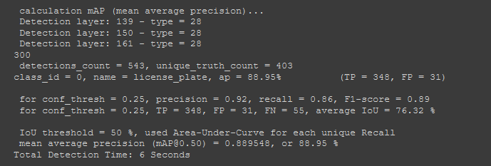
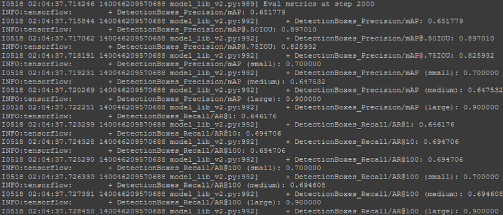
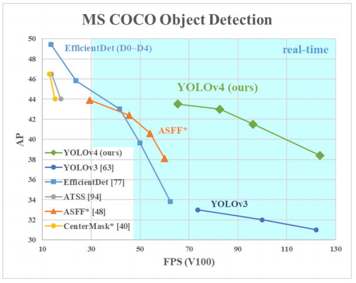
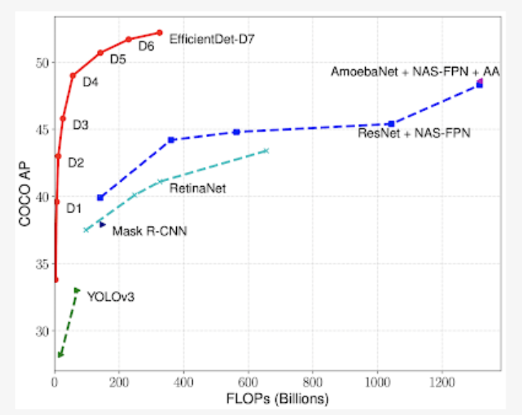
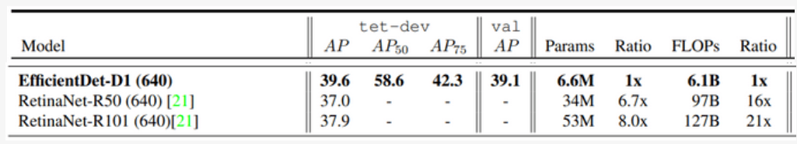
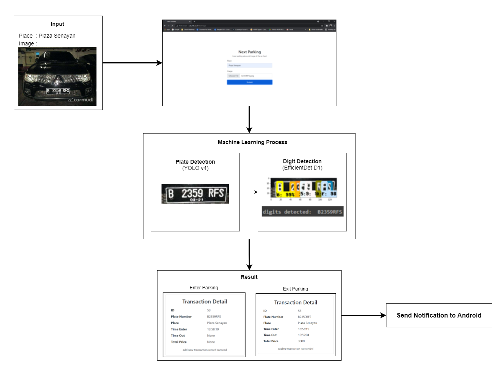

 

  <h2 align="center">Next Parking Plate Number Reader</h2>
  <h3 align="center">Pay, save and track your parking.</h3>

## Built With

- [Tensorflow](https://www.tensorflow.org/)
- [OpenCV](https://opencv.org/)
- [Google Colab](https://colab.research.google.com/)

## Technique Used

### Object Plate Detection
For the first process, we use YoloV4 to detect the location of plate number in the car. For the result of the training is good. We achieve 89% mAP and 6s prediction time using GPU.

This is our training result

    

### Digit Number Detection

We use TensorFlow Object Detection API with EfficientDet D1 model for our digit number detector. TensorFlow Object Detection Api make it easy to localizing and identifying multiple objects (digit numbers) in a single image (plate number image). EfficientDet D1 model which previously trained on our dataset try to produce object class and bounding box predictions respectively of each digit numbers in a single plate number with highest similarity score.

This is our training result :

    

After we trained the model on 441 images of Indonesian License Plate Number, we got 89.7% mAP over 50% IOU threshold and 82.6% mAP over 75% IOU threshold.

You can see the detail of our training process and dataset that we use <a href="https://github.com/sekarlm/license-plate-recognition/tree/main/digits_recognition">here</a>.

## State of Arts or Journal

### Object Plate Detection

For object plate detection, we use YOLOv4. The reason, why we use it is because we need high FPS for real time detection and high AP. And YOLO can do it.

    

From the graph, we can see that YOLO can maintain high FPS and high AP for real time detection.

You can find yolo journal [here.](https://arxiv.org/abs/2004.10934)

### Digit Number Recognition

    

As you can see from the graph above, efficientDet achieves state-of-the-art accuracy while being up to <b>9x smaller</b> and using up to <b>43x fewer computation</b> compared to prior state-of-the-art detectors.

    

For this project we choose EfficientDet D1. As you can see from the table, compared to the other models in the same distribution, it achieves higher accuracy with 39.6 Average Precision, uses much fewer parameters (6.6 M), and uses fewer computation operations (6.1B FLOPs).

You can find the complete journal <a href="https://arxiv.org/abs/1911.09070">here</a>.

## Explanation For Workflow

    

1. To simulate image upload from cctv we create simple web page to upload image of a car with its plate number on it and parking lot location where we park the car. 
2. Then, the input will be processed by two machine learning process. First, YOLOv4 object detector will detect and crop plate number object. The second one is EfficientDet D1 digit detector that will recognize all the digit numbers. 
3. Then, the system will create transaction report based on its condition, wheter it is about to enter or exit the parking lot. 
4. Finally, the system will send notification to android.

## Acknowledgements

